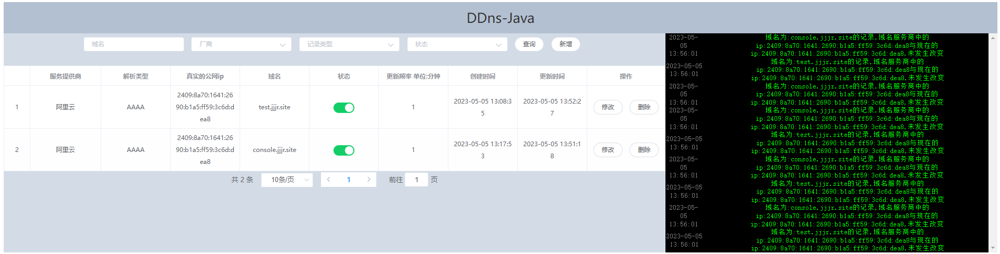

<h1 align="center" style="margin: 30px 0 30px; font-weight: bold;">ddns4j-spring-boot-starter v1.0.3</h1>
<h4 align="center" style="margin: 30px 0 30px; font-weight: bold;">DDNS4J -- 让动态域名解析变的更简单</h4>

<p align="center">
<a href='https://gitee.com/Xsssd/ddns4j-spring-boot-starter/stargazers'></img></a>
<a href='https://gitee.com/Xsssd/ddns4j-spring-boot-starter/members'></img></a>
<a href='https://img.shields.io/badge/license-apache-blue'></img></a>
</p>

## 简介
>`ddns4j-spring-boot-starter` 是一个用于集成 DDNS4J 到 Spring Boot 应用的 Starter。DDNS4J 是一个完全开源的 DDNS 服务，支持 IPv4 和 IPv6，允许用户动态更新域名解析记录，以方便将SpringBoot项目提供给外部展示及调试。
## 特点
- 支持SpringBoot生态。
- 支持多种 DDNS 服务提供商，包括阿里云、腾讯云和 Cloudflare。
- 自动检测 IPv4 或 IPv6 公共地址并更新解析记录。
- 默认开启 Cloudflare 代理以提高性能和安全性。
## 使用
### 添加依赖
```xml
<dependency>
    <groupId>top.sssd</groupId>
    <artifactId>ddns4j-spring-boot-starter</artifactId>
    <version>1.0.3</version>
</dependency>
```
### 简易功能配置
```yaml
ddns4j:
  enabled: true  #是否开启ddns4j
  shutdown-on-cleared: true #关闭时清除dns记录
  easy-mode:
    service-provider: 1 # 1 阿里云 2 腾讯云 3 cloudflare
    service-provider-id: your-service-provider-id
    service-provider-secret: your-service-provider-secret
    domain: your-domain
```
### 简易版查看是否正常运行

### 完整功能配置
>在 application.properties 或 application.yml 文件中添加以下配置：
```yaml
ddns4j:
  enabled: true #是否开启ddns4j,默认为关闭
  shutdown-on-cleared: true #是否在服务关闭时,清除dns记录
```
### 启动web项目
>在浏览器中http:ip:port/ddns4j.html 即可访问




## 交流群
群二维码.png "QQ群二维码")

## 推荐阅读
如果想要深入了解 DDNS 和 DDNS4J，可以访问我的独立使用的项目[DDNS4J](https://github.com/Xsssd/ddns4j) 或者我的博客 https://blog.sssd.top

该博客站点就是使用ddn4j搭建而成,响应较慢请大家海涵!了解更多有关网络和开发的知识。